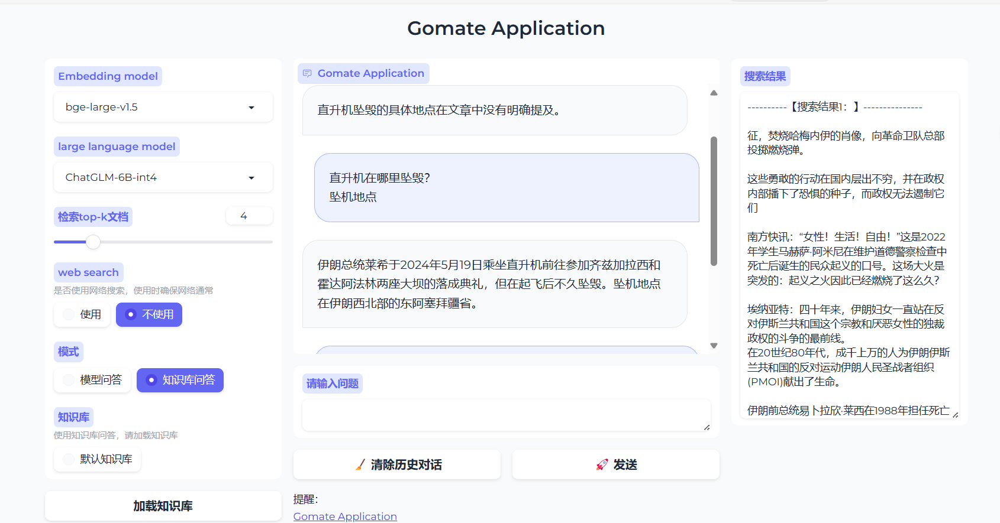

# Awesome-AGI

欢迎来到 **Awesome-AGI**，这是一个精心整理的人工通用智能（AGI）项目和资源列表。

觉得有用请点个 Star 吧！

## 目录

- [Awesome-AGI](#awesome-agi)
	- [目录](#目录)
	- [应用项目](#应用项目)
		- [lobehub/lobe-chat ](#lobehublobe-chat-)
		- [QAnything ](#qanything-)
		- [open-webui/open-webui ](#open-webuiopen-webui-)
		- [QuivrHQ/quivr ](#quivrhqquivr-)
		- [⭐️ rashadphz/farfalle 搜索 ](#️-rashadphzfarfalle-搜索-)
		- [truefoundry/cognita ](#truefoundrycognita-)
		- [toeverything/AFFiNE ](#toeverythingaffine-)
		- [weaviate/Verba ](#weaviateverba-)
		- [vercel/ai-chatbot ](#vercelai-chatbot-)
		- [Bin-Huang/chatbox 客户端 ](#bin-huangchatbox-客户端-)
		- [mckaywrigley/chatbot-ui ](#mckaywrigleychatbot-ui-)
		- [langflow-ai/langflow ](#langflow-ailangflow-)
		- [Mintplex-Labs/anything-llm 客户端 ](#mintplex-labsanything-llm-客户端-)
		- [dissorial/doc-chatbot ](#dissorialdoc-chatbot-)
		- [openai/openai-assistants-quickstart 应用模版 ](#openaiopenai-assistants-quickstart-应用模版-)
		- [wandb/openui 代码生成 ](#wandbopenui-代码生成-)
		- [⭐️ OpenDevin/OpenDevin 代码生成 ](#️-opendevinopendevin-代码生成-)
		- [stitionai/devika 代码生成 ](#stitionaidevika-代码生成-)
		- [OpenBMB/ChatDev代码生成 ](#openbmbchatdev代码生成-)
		- [khoj-ai/khoj AI助手 ](#khoj-aikhoj-ai助手-)
		- [weaviate/Verba ](#weaviateverba--1)
		- [stanford-oval/storm 报告 ](#stanford-ovalstorm-报告-)
		- [ihmily/outfit-anyone 虚拟试穿 ](#ihmilyoutfit-anyone-虚拟试穿-)
		- [binary-husky/gpt\_academic: ](#binary-huskygpt_academic-)
		- [gomate-community/GoMate ](#gomate-communitygomate-)
		- [sqlchat/sqlchat ](#sqlchatsqlchat-)
		- [tencentmusic/supersonic 智能BI ](#tencentmusicsupersonic-智能bi-)

## 应用项目

### [lobehub/lobe-chat](https://github.com/lobehub/lobe-chat) 

 是一个开源的现代设计 LLMs/AI 聊天框架，支持多个 AI 提供商（如 OpenAI、Claude 3、Gemini 等）、多模态（视觉 / TTS）和插件系统，提供了一键免费部署私人 ChatGPT 聊天应用的功能。

**摘要**
lobehub/lobe-chat 项目是一个开放源码的现代设计的大型语言模型（LLMs）和 AI 聊天框架，它支持多种 AI 服务提供商，包括但不限于 OpenAI、Claude 3、Gemini、Ollama、Bedrock、Azure、Mistral 和 Perplexity。该框架还支持多模态功能，如视觉和语音合成（TTS），并且具备插件系统，允许用户扩展功能。此外，该项目提供了一键部署功能，使用户能够快速搭建和部署自己的私人 ChatGPT 聊天应用。

项目的 GitHub 页面提供了多种互动选项，包括关注、不再关注、加入收藏列表（目前处于测试阶段）、分享反馈和报告滥用行为。用户可以通过 GitHub Sponsors 或外部链接（如 Open Collective 和 IssueHunt）为项目提供资金支持。项目使用 MIT 许可证，并遵循行为准则。

项目的代码库包括了多个文件夹和文件，如 .github（用于 GitHub 特定配置）、.husky（用于 Git 钩子）、__mocks__（用于测试模拟）、contributing（用于贡献指南）、docs（用于文档）、locales（用于本地化）、public（用于公共资源）、scripts（用于脚本）、src（用于源代码）、tests（用于测试代码），以及配置文件如 .bunfig.toml、.changelogrc.js、.commitlintrc.js、.dockerignore、.editorconfig、.env.example、.eslintignore、.eslintrc.js 和 .gitignore。

项目的提交历史显示了持续的更新和维护，包括特性添加、代码修复、样式调整、测试添加、文档更新等。例如，最近的更新包括了对代码块显示问题的修复、对服务接口的重构、对多语言标签弹出窗口样式的更新等。

**特点**
- 开源和现代设计: lobehub/lobe-chat 强调了其开源性质和现代化的设计理念，旨在为用户提供一个易于使用和扩展的 AI 聊天框架。
- 多 AI 提供商支持: 该框架的一个关键特点是其对多个 AI 服务提供商的支持，这使得用户可以根据自己的需求选择合适的 AI 服务。
- 多模态和插件系统: 项目支持多模态交互，包括视觉和语音合成，同时提供了插件系统，以便用户可以自定义和增强框架的功能。
-  一键部署: 提供了一键部署功能，简化了用户搭建私人 ChatGPT 聊天应用的过程。
- 持续更新和维护: 通过提交历史和文件更新记录，可以看出项目团队对于持续改进和维护项目的承诺。
- 社区参与和支持: 项目鼓励社区参与，提供了多种方式让用户和开发者参与到项目中，包括贡献代码、报告问题、提供资金支持等。
- 文档和配置完善: 项目提供了详细的文档和配置文件，以帮助用户理解和使用框架。

### [QAnything](https://github.com/QAnything/QAnything) 
 是一个支持多种文件格式和数据库的本地知识库问答系统，可以断网使用，具备数据安全、跨语种问答、海量数据处理、高性能和易用性等特点。

**摘要**

QAnything 项目是一个基于任意格式文件或数据库的本地知识库问答系统，名为 QAnything（Question and Answer based on Anything），它允许用户将任何格式的本地文件导入，并提供准确、快速的问答服务。该系统支持多种文件格式，包括 PDF、Word、PPT、XLS、Markdown、电子邮件、TXT、图片、CSV 和网页链接等。

QAnything 的特点包括数据安全，支持全程拔网线安装使用；跨语种问答，无所谓文件是什么语种；支持海量数据问答，采用两阶段向量排序解决大规模数据检索退化问题；高性能生产级系统，适合企业应用；易用性，无需繁琐的配置，一键安装部署；支持选择多知识库问答。

该系统采用两阶段检索架构，使用 BCEmbedding 检索组件，具备强大的双语和跨语种能力。一阶段检索使用 embedding 模型，二阶段检索使用 rerank 模型，两者的评测结果显示 QAnything 的模型在多项指标上表现出色。

QAnything 的最新更新包括支持与 OpenAI API 兼容的其他 LLM 服务，提供优化后的 PDF 解析器，以及支持联网检索、FAQ、自定义 BOT、文件溯源等功能。项目提供了两种安装方式：python 版本和 docker 版本，适用于不同的使用场景和环境。

项目还提供了详细的安装文档、API 支持、常见问题解答、路线图、交流支持渠道等。QAnything 依照 Apache 2.0 协议开源，并欢迎社区的贡献。

**特点**

- 数据安全与隐私保护: QAnything 强调数据安全，支持断网安装和使用，确保用户数据不会泄露到外网。
- 跨语种问答能力: 系统支持中英文问答，能够处理不同语言的文件，无需用户区分语种。
- 海量数据处理: 通过两阶段检索机制，QAnything 能够有效处理大量数据的问答，保证检索效率和准确性不会因数据量增加而退化。
- 高性能与生产级应用: 该系统设计为高性能的生产级解决方案，可以直接部署到企业环境中。
- 易用性: QAnything 注重用户体验，提供了一键安装部署的便捷操作，减少了配置的复杂性。
- 多知识库支持: 用户可以选择多个知识库进行问答，增强了系统的灵活性和适用性。
- 开源与社区贡献: QAnything 作为一个开源项目，鼓励社区成员的参与和贡献，并提供了详细的文档和支持渠道。
- 持续更新与迭代: 项目团队致力于不断更新和改进系统，包括支持新的文件格式、优化问答效果、增加新功能等。

### [open-webui/open-webui](https://github.com/open-webui/open-webui) 
 是一个用户友好的自托管 WebUI，支持多种大型语言模型（LLMs）运行器，包括 Ollama 和 OpenAI 兼容的 API。

**摘要**

open-webui/open-webui 项目是一个开源的 Web 界面，旨在提供一个易于使用、功能丰富且完全可以离线运行的平台。该项目曾名为 Ollama WebUI，现在更名为 Open WebUI，支持多种 LLMs 运行器，并提供了详细的文档和安装指南。用户可以通过 Docker 快速启动，支持 GPU 加速和 OpenAI API 的使用。项目还提供了一个社区版本，用户可以在其中分享和探索定制化的 Modelfiles。此外，项目还鼓励社区成员通过赞助和反馈来支持项目的发展。

**特点**

- 用户友好性: Open WebUI 设计了一个直观的界面，使得用户可以轻松地安装和使用。
- 离线运行: 该 WebUI 支持完全离线操作，适合对隐私和安全性有高要求的环境。
- 多运行器支持: 项目支持 Ollama 和 OpenAI 兼容的 API，提供了灵活性，以适应不同的用户需求。
- 社区驱动: 项目鼓励社区参与，提供了一个平台让用户可以分享自己的 Modelfiles，同时也接受赞助来支持项目的持续发展。
- 文档和支持: 项目提供了详细的安装文档、使用指南和故障排除信息，以帮助用户解决安装和使用过程中遇到的问题。
- 更新和维护: 项目提供了更新指南，帮助用户保持其 Docker 安装的最新状态。
- 迁移指南: 为了帮助从 Ollama WebUI 迁移到 Open WebUI，项目提供了迁移指南。
- 开发路线图: 项目在其文档中提供了未来功能的发展路线图，让用户了解即将推出的新特性。

### [QuivrHQ/quivr](https://github.com/QuivrHQ/quivr) 

QuivrHQ/quivr 是一个基于生成式人工智能（GenAI）的个人生产力助手，旨在作为一个第二大脑，帮助用户通过与文档（如 PDF、CSV 等）和应用程序的对话来组织和管理信息。它支持多种语言模型，如 Langchain、GPT 3.5/4 turbo、Anthropic、VertexAI、Ollama 和 Groq，并提供了一个本地和私有的替代方案，以此来替代 OpenAI 的 GPT 和 ChatGPT。

**摘要**

QuivrHQ/quivr 项目的 GitHub 页面提供了关于该项目的详细信息，包括它是如何作为一个个人生产力助手，利用检索增强生成（RAG）技术来帮助用户管理和查询信息。用户可以通过创建列表来组织自己的收藏仓库，并为列表添加名称和描述。该项目目前处于测试阶段，鼓励用户分享反馈和报告错误。

该项目使用 Apache-2.0 许可证，已经获得了 33.4k 的星标和 3.3k 的叉子。用户可以通过关注项目来接收推送通知，或者选择将项目的副本存储在自己的账户中。GitHub 页面还提供了项目的历史记录，包括最新的提交信息和日期，以及项目的文件和文件夹结构。

该项目的最新提交包括更新 AWS 服务的任务定义文件中的 CPU 和内存设置，以及更新开发容器配置文件。这些更新旨在提高项目的性能和资源利用率。

**特点**

- **本地和私有的 AI 助手**: QuivrHQ/quivr 提供了一个本地和私有的 AI 助手，这为用户提供了更高的数据隐私和安全性。
- **多语言模型支持**: 项目支持多种语言模型，包括但不限于 GPT 3.5/4 turbo、Anthropic、VertexAI 等，这使得用户可以根据自己的需求选择合适的语言模型。
- **检索增强生成技术**: Quivr 使用了 RAG 技术，这种技术结合了检索系统和生成模型，以提供更准确和相关的信息响应。
- **用户参与和反馈**: 项目鼓励用户参与测试，并提供反馈和错误报告，这有助于项目的持续改进和完善。
- **资源优化**: 通过增加 CPU 和内存资源的分配，项目提升了 AWS 服务的性能，这对于处理大型工作负载至关重要。
- **开发环境的便捷性**: 通过更新 `.devcontainer` 文件，项目提供了一个预配置的开发环境，这简化了开发者的设置过程，并确保了一致性的开发环境。

### ⭐️ [rashadphz/farfalle](https://github.com/rashadphz/farfalle) 搜索 

`rashadphz/farfalle` 是一个开源的 AI 搜索引擎项目，允许用户通过本地或云端的大型语言模型（LLMs）进行搜索和问题回答。

**概述**

`rashadphz/farfalle` 项目是一个类似 Perplexity 的 AI 搜索引擎，支持使用本地或云端的大型语言模型（如 llama3、gemma、mistral、phi3、Groq/Llama3、OpenAI/gpt4-o）来进行搜索和问题回答。项目的前端采用 Next.js，后端使用 FastAPI，搜索 API 可以选择 SearXNG 或 Tavily，日志管理使用 Logfire，限流采用 Redis，UI 组件使用 shadcn/ui。

项目提供了一个实时演示（farfalle.dev），展示了使用云端模型的搜索引擎功能。此外，项目还有一个技术路线图，计划添加对本地 LLMs 的支持，设置 Docker 部署，整合 Searxng 以及与 LiteLLM 协作。

要在本地启动和使用该项目，用户需要安装 Docker 和 Ollama，并且可能需要获取 Tavily、OpenAI 或 Groq 的 API 密钥。接下来，用户需要克隆仓库、配置环境变量、运行 Docker Compose 以及按照自定义设置指南进行操作。

部署时，用户需要将后端部署到 Render 并获取 Web 服务 URL，然后在 Vercel 上部署前端时使用该 URL。项目还提供了指导，教用户如何将 Farfalle 设置为默认搜索引擎。

该项目目前有 1.3k 个星标、10 个关注者和 97 个叉子。项目使用 Apache-2.0 许可证，并且还没有发布正式版本。项目的主要贡献者是 rashadphz 和 arsaboo。

**特点**

- **开源 AI 搜索引擎**: `rashadphz/farfalle` 是一个开源项目，旨在为用户提供一个由 AI 驱动的搜索引擎，可以使用本地或云端的大型语言模型进行搜索和问题解答。
- **技术栈**: 项目采用了现代化的技术栈，包括 Next.js、FastAPI、SearXNG/Tavily、Logfire 和 Redis，以及 shadcn/ui 组件库。
- **本地与云端模型支持**: 用户可以选择使用本地的大型语言模型或者云端服务进行搜索，提供了灵活的部署选项。
- **易于部署与使用**: 项目提供了详细的文档和步骤指南，使得用户能够容易地在本地或云端部署和使用搜索引擎。
- **定制化设置**: 项目支持自定义设置，包括配置不同的搜索提供商和环境变量，以及提供自定义部署指南。
- **社区与协作**: 项目鼓励社区参与和贡献，提供了问题跟踪和讨论平台，同时也展示了项目的贡献者列表。
- **许可与版本**: 项目遵循 Apache-2.0 许可证，并且还没有正式发布版本，表明项目可能仍在积极开发中。

### [truefoundry/cognita](https://github.com/truefoundry/cognita) 

`truefoundry/cognita` 是一个开源的 RAG（Retrieval Augmented Generation）框架，旨在帮助开发者构建模块化、可扩展的生产级应用程序。

**概述**

`truefoundry/cognita` 是由 TrueFoundry 开发的一个 RAG 框架，用于在生产环境中构建开源的、模块化的应用程序。该框架使用 Langchain/LlamaIndex 提供的抽象，使得在 Jupyter 笔记本上进行快速实验和原型设计变得容易，同时也支持在本地环境中轻松使用，并提供了一个无需编码的 UI 支持。Cognita 支持增量索引，并且具有模块化的组件结构，包括数据源、元数据存储、LLM Gateway、向量数据库（Vector DB）和索引作业等。用户可以通过本地运行或使用 TrueFoundry 的部署来体验 Cognita，并且可以通过自定义查询控制器（Query Controller）来实现问答系统。Cognita 的代码结构清晰，允许用户自定义数据加载器、嵌入模型、解析器和向量数据库等组件，以适应特定的使用场景。此外，Cognita 还支持多种文档检索器、嵌入模型、重排器以及增量索引功能。

**特点**

- **模块化和可扩展性**: Cognita 提供了一个组织良好的代码库，其中包含了可重用的解析器、加载器、嵌入模型和检索器，使得代码库易于测试和部署。
- **用户友好的 UI**: 非技术用户可以通过 UI 上传文档并执行问答任务，同时也支持 API 驱动，允许与其他系统集成。
- **生产就绪环境**: Cognita 支持本地设置和生产环境部署，提供了一个 FastAPI 服务器来处理用户查询并生成答案。
- **灵活的自定义选项**: 用户可以根据自己的需求自定义数据加载器、嵌入模型、解析器和向量数据库等组件。
- **增量索引**: Cognita 支持对文档进行增量索引，减少了计算负担，并且能够跟踪已索引的文档，防止重复索引。
- **问答系统**: 通过查询控制器，Cognita 能够处理用户的问题，并使用 LLM 模型生成答案，同时还可以选择性地丰富相关文档的元数据。
- **开源贡献**: Cognita 鼓励开源贡献，并提供了详细的文档和指南，帮助开发者参与到项目中来。

### [toeverything/AFFiNE](https://github.com/toeverything/AFFiNE.git) 
 是一个开源的下一代知识库，它结合了规划、分类和创作功能，注重隐私，高度可定制，并且已经准备好使用。

**摘要**
AFFiNE（发音为 [ə‘fain]）是一个开源的下一代知识库，它旨在超越 Notion 和 Miro。它提供了创建列表的功能，用于组织用户的星标仓库，允许用户为列表添加名称和描述，并通过输入冒号来添加表情符号。该项目目前处于测试阶段，鼓励用户提供反馈和报告错误。AFFiNE 还提供了通过 GitHub Sponsors 为项目提供资金的方式，以及通过 Fork 机制复制项目的选项。此外，AFFiNE 还提供了通知设置，用户可以在 iOS 或 Android 上接收推送通知。项目遵循 MIT 许可证，并有一项安全策略和行为准则。截至目前，AFFiNE 拥有 34.1k 的星标和 2.2k 的分支，以及 188 名观察者。项目还提供了通过 GitHub Codespaces 直接在浏览器中编辑代码的功能。

**特点**
- AFFiNE 定位为下一代知识库，旨在提供比现有工具如 Notion 和 Miro 更多的功能。
- 项目强调隐私优先，并且是开源的，鼓励社区参与和改进。
- 可定制性是 AFFiNE 的一个重要特点，用户可以根据自己的需求进行调整。
- AFFiNE 支持通知功能，用户可以在移动设备上接收推送通知。
- 项目采用MIT 许可证，保证了代码的开放性和可复用性。
- AFFiNE 提供了行为准则和安全策略，确保了项目的健康社区环境。
- 项目的受欢迎程度可以从其在 GitHub 上的星标和分支数量中看出。
- 通过GitHub Sponsors，用户可以为 AFFiNE 项目提供资金支持。
- GitHub Codespaces的集成，允许用户在云端环境中直接编辑和运行项目代码。

### [weaviate/Verba](https://github.com/weaviate/Verba) 

 是一个开源的 Retrieval Augmented Generation (RAG) 聊天机器人，由 Weaviate 支持，它提供了一个端到端的用户友好型界面，允许用户通过本地的 HuggingFace 和 Ollama，或者通过云服务提供商如 OpenAI、Cohere 和 Google 等轻松探索数据集并提取洞察。

**摘要**

Verba 是一个基于 Weaviate 的开源项目，它实现了一个基于 RAG 的聊天机器人，用户可以通过该机器人与数据进行交互，并从中提取信息。该项目支持多种模型和数据格式，包括 PDF 和 CSV/XLSX 文件，并且可以通过多种方式部署，包括直接安装、源代码构建或使用 Docker。Verba 支持的功能包括混合搜索、语义缓存、自动完成建议等，同时也提供了 API 密钥配置说明，以及如何通过 pip 部署 Verba。项目鼓励社区贡献，并提供了详细的技术和前端文档。

**特点**

- 模型和数据支持: Verba 支持多种 LLM 提供商的模型，如 OpenAI、Cohere、Google 和 HuggingFace，同时也支持不同类型的数据导入，包括 PDF 和 CSV/XLSX 文件。
- 部署灵活性: Verba 提供了多种部署方式，以适应不同的用户需求和环境，包括本地部署和云服务。
- 功能和特性: Verba 提供了诸如混合搜索、语义缓存和自动完成等高级功能，同时正在计划实现更多功能，如过滤、高级查询和结果重新排序。
- 开源和社区参与: Verba 鼓励开源贡献，并提供了详细的文档和社区支持，以帮助用户理解项目架构并参与到项目中。
- 配置和使用: 项目提供了详细的 API 密钥配置指南，以及通过 pip、源代码或 Docker 部署 Verba 的步骤说明。
- 已知问题和常见问题: 项目已经列出了一些已知问题，并提供了常见问题的解答，以帮助用户解决可能遇到的问题。

### [vercel/ai-chatbot](https://github.com/vercel/ai-chatbot) 

 的 AI 聊天机器人项目可以在本地环境中运行。

**摘要**
Vercel 的 AI 聊天机器人项目是一个基于 Next.js 构建的、功能全面且可定制的聊天机器人。对于开发者来说，项目提供了在本地环境中运行和测试的说明。这些指令通常包括克隆仓库、安装依赖、配置环境变量以及启动开发服务器等步骤。通过在本地运行，开发者可以更容易地理解项目结构，调试代码，以及进行个性化的开发。

**特点**
- 本地运行是开发和测试 AI 聊天机器人的重要步骤：开发者可以在不影响生产环境的情况下进行实验和迭代。
- 项目易于启动和配置：通过遵循文档中的步骤，开发者可以快速地在本地环境中搭建起整个聊天机器人系统。
- 本地环境的使用有助于提高开发效率：开发者可以即时看到代码变更的效果，便于调试和优化。
- 项目的可定制性：提供在本地运行的能力使得开发者能够根据自己的需求对聊天机器人进行定制和扩展。

### [Bin-Huang/chatbox](https://github.com/Bin-Huang/chatbox) 客户端 

Bin-Huang/chatbox 是一个用户友好的桌面客户端应用程序，用于与 AI 模型/大型语言模型（如 GPT、Claude、Gemini、Ollama 等）交互，支持 Windows、Mac 和 Linux 系统。

**概述**

Bin-Huang/chatbox 是一个开源项目，旨在提供一个简单易用的桌面客户端，用于与多种 AI 模型和大型语言模型进行交互。该项目支持多种操作系统，包括 Windows、MacOS 和 Linux。用户可以通过下载相应的安装包进行安装，并且还可以在 iOS 和 Android 设备上使用。项目的特点包括易用性、多平台支持以及社区驱动的持续开发和改进。项目创建者 Bin-Huang 最初是为了调试提示而开发 Chatbox，随着社区的反馈和贡献，该项目已经发展成为一个功能丰富的 AI 桌面应用程序，被用户用于各种场景，如日常聊天、专业工作辅助等。

项目的贡献方式包括提交问题、拉取请求、功能请求、错误报告、文档修订、翻译和其他形式的贡献。项目的构建指南、常见问题解答（FAQ）、支付方式（包括 Paypal、微信支付和支付宝）以及许可证信息（GPL-3.0）都在项目的 GitHub 页面上提供。此外，项目还提供了一个星标历史记录，以及通过 GitHub Releases 页面提供的所有版本的下载链接。截至目前，该项目有 19k 个星标、121 个关注者和 1.9k 个叉子。

**特点**

- **用户友好性**: Chatbox 旨在提供一个简单易用的界面，让用户能够轻松地与 AI 模型交互。
- **多平台支持**: 提供了针对 Windows、MacOS 和 Linux 的安装包，以及 iOS 和 Android 的支持。
- **社区驱动**: 项目的发展和改进依赖于社区的反馈和贡献。
- **开源精神**: Chatbox 是一个开源项目，鼓励各种形式的贡献，包括代码、文档和翻译等。
- **持续更新**: 项目定期发布新版本，并提供了一个详细的版本历史记录。
- **多功能性**: Chatbox 不仅可以用于开发和调试提示，还可以用于日常聊天和专业工作辅助。
- **支付方式**: 提供了多种支付方式以支持项目的发展，包括 Paypal、微信支付和支付宝。
- **许可证**: Chatbox 采用 GPL-3.0 许可证，确保了软件的自由传播和修改。

### [mckaywrigley/chatbot-ui](https://github.com/mckaywrigley/chatbot-ui) 
 是一个开源项目，旨在为每个 AI 模型提供聊天界面。

**摘要**

mckaywrigley/chatbot-ui 项目的 GitHub 页面展示了该项目的基本信息和代码仓库结构。该项目已有 26.8k 的星标和 7.4k 的叉子，有 243 名用户在关注该项目的变化。项目的最新提交是在 2024 年 5 月 16 日，提交内容包括修复图片 URL 参数问题。项目包含多个文件夹和文件，如 .github、 .husky、 __tests__、 app、 components、 context、 db、 lib、 public、 supabase、 types 和 worker 等，每个部分都有自己的功能和提交记录。例如，.husky 文件夹用于存储 API 密钥，components 文件夹包含项目的组件文件，而 public 文件夹包含项目的公共资源。项目还包括环境变量示例文件 .env.local.example、代码规范配置文件 .eslintrc.json、忽略文件配置 .gitignore、Node 版本管理文件 .nvmrc 和项目的 README 文件 README.md。此外，还有一个 components.json 文件用于组件配置，以及一个 i18nConfig.js 文件用于国际化配置。

**特点**
- 开源项目: mckaywrigley/chatbot-ui 是一个公开的、可以被社区成员免费使用和贡献的项目。
- 社区活跃度: 项目拥有大量的星标和叉子，以及活跃的关注者和贡献者，反映了该项目在 GitHub 上的高人气和活跃度。
- 持续更新: 项目经常接受新的提交和更新，表明项目维护者对其进行持续的维护和改进。
- 功能丰富: 项目包含多个组件和文件夹，涵盖了从前端到后端的各个方面，提供了一个完整的聊天界面解决方案。
- 跨平台支持: 项目支持跨平台功能，例如通过 iOS 或 Android 设备接收推送通知。
- 用户反馈和报告: 项目鼓励用户提供反馈和报告问题，这有助于改进项目并提高其质量。
- 环境配置: 通过 .env.local.example 文件提供了环境变量的示例，方便用户配置和部署项目。
- 代码规范: 项目使用 .eslintrc.json 文件来确保代码质量和一致性。
- 国际化支持: 通过 i18nConfig.js 文件，项目支持多语言，增强了其适用性和用户体验。

### [langflow-ai/langflow](https://github.com/langflow-ai/langflow) 

`langflow-ai/langflow` 是一个开源项目，提供了一个动态图，其中每个节点都是一个可执行单元，旨在通过模块化和交互式设计促进快速实验和原型设计，推动创造力的边界。

**概述**

该网页是 `langflow-ai/langflow` 项目的 GitHub 页面，项目介绍指出 Langflow 是一个动态图，它通过模块化和交互式的设计，使得每个节点都成为一个可执行单元，从而促进了快速的实验和原型设计，推动了创新的边界。网页提供了创建列表的功能，用于组织个人星标的仓库，并允许用户为列表命名和描述。此外，网页还提供了反馈和报告错误的途径，因为列表功能目前处于测试阶段。项目的主页 `www.langflow.org` 提供了更多关于 Langflow 的信息。该项目采用 MIT 许可证，并有一项行为准则。截至目前，该项目有 18.2k 个星标、2.7k 个叉子和 157 个观察者。网页还展示了项目的分支和标签，并提供了通过 GitHub.dev 或 Codespace 打开项目的选项。用户可以通过 fork 项目来创建自己的副本，并且可以选择在 iOS 或 Android 设备上接收推送通知。

**特点**

- **Langflow 项目的核心是其动态图结构，它允许每个节点作为一个可执行单元，促进了高效的实验和原型设计。**
- 项目鼓励社区参与和反馈，特别是对于其新的列表功能，这表明项目团队致力于持续改进和完善产品。
- **Langflow 项目的开放性和模块化设计是其吸引力的关键，使其能够适应多种用户需求和创意实验。**
- MIT 许可证的使用体现了项目的开源精神，鼓励代码的复用和分享。
- 项目的流行度可以通过其在 GitHub 上的星标和叉子数量来体现，这表明它在开发者社区中具有一定的影响力和认可度。
- 通过提供多种接入和参与项目的方式，如通过 GitHub.dev、Codespace 以及移动设备通知，Langflow 项目展现了其对用户体验的重视。

### [Mintplex-Labs/anything-llm](https://github.com/Mintplex-Labs/anything-llm) 客户端 

Mintplex-Labs/anything-llm 是一个集成了各种 AI 功能的桌面和 Docker 应用程序，支持全面的 RAG（Retrieve-Augmented-Generative）和 AI 代理功能。

**摘要**

Mintplex-Labs/anything-llm 是一个开源项目，旨在提供一个全能型的 AI 应用程序，支持桌面和 Docker 部署。该项目最新的提交是在 2024 年 5 月 24 日，实现了 Bing 搜索 API 的 Web 搜索提供者。项目拥有 14.9k stars 和 1.5k forks，并且有 118 名观察者。该应用程序支持语音转文本和文本转语音功能，并且可以通过 GitHub Codespaces 和 VSCode 的开发容器进行开发。最近的更新包括添加 Bing 搜索引擎、更新 README、实现 GitHub Codespaces 和 VSCode 开发容器的支持，以及对 Kubernetes 清单的更新。此外，还对项目的前端、服务端、图片和其他组件进行了更新和维护。项目遵循 MIT 许可证，并且提供了一个安全策略。用户可以通过 GitHub Sponsors 来资助该项目。

**特点**

- **集成 AI 功能**: 该项目提供了一个集成了多种 AI 功能的应用程序，包括 RAG 和 AI 代理功能，这使得用户能够利用 AI 进行增强型的生成和检索任务。
- **多平台支持**: Mintplex-Labs/anything-llm 可以作为桌面应用程序运行，也可以通过 Docker 容器化部署，提供了灵活的使用选择。
- **开源和社区驱动**: 作为一个开源项目，Mintplex-Labs/anything-llm 鼓励社区成员的参与和贡献，这体现在其高star和fork数量上。
- **持续更新和维护**: 项目团队持续对代码进行更新和维护，包括添加新功能、优化现有功能以及修复问题。
- **易于开发和部署**: 通过集成 GitHub Codespaces 和 VSCode 的开发容器，项目提供了一个简化的开发和部署流程。
- **透明的安全和许可策略**: 该项目遵循 MIT 许可证，并且提供了一个明确的安全策略，确保了用户对项目的信任和安全性。
- **资金支持机制**: 通过 GitHub Sponsors，用户和组织可以为该项目提供资金支持，以支持其持续发展。

### [dissorial/doc-chatbot](https://github.com/dissorial/doc-chatbot) 

 是一个基于 GPT 的文档聊天机器人项目，支持多文件、多话题、多聊天窗口和聊天历史记录，可以在浏览器中上传文件并与 Pinecone 和 LangChain 集成。

**摘要**

dissorial/doc-chatbot 项目旨在通过 GPT、Pinecone 和 LangChain 的结合，提供一个功能强大的文档聊天机器人。该机器人允许用户创建多个话题进行聊天，支持存储任意数量的文件到每个话题，并为每个话题创建任意数量的聊天窗口。用户可以在浏览器中上传 .pdf、.docx 和 .txt 文件，将它们转换为嵌入向量，存储在 Pinecone 中，并且可以删除 Pinecone 命名空间。聊天机器人还支持本地存储，自动检索所有聊天的历史记录。

项目的特性包括：

支持多个话题的创建
每个话题可以存储任意数量的文件
支持创建多个聊天窗口
在浏览器中上传文件、转换为嵌入向量、存储在 Pinecone 中、删除 Pinecone 命名空间的功能
本地存储和自动检索聊天历史记录
支持 .pdf、.docx 和 .txt 文件格式
此外，项目提供了本地设置和开发的指南，包括克隆仓库、配置 Pinecone、安装依赖包、设置环境变量、部署和运行应用程序的步骤。项目还提供了故障排除指南，解决了一些常见的问题和错误。

**特点**
- 多功能性: 该项目强调了聊天机器人的多功能性，包括对多个话题和文件的支持，以及多聊天窗口的管理。
- 集成技术: 项目利用了最新的技术栈，如 GPT、Pinecone 和 LangChain，以及 Next.js、Tailwind CSS 等前端技术。
- 用户友好性: 通过在浏览器中提供文件上传和管理功能，项目提高了用户的操作便捷性。
- 本地存储和历史记录: 聊天机器人的能力在本地存储聊天历史，为用户提供了更加持久和可靠的聊天体验。
- 开发和部署指导: 项目提供了详细的本地开发和部署指南，使得开发者能够更容易地设置和运行自己的实例。
- 灵活性和可扩展性: 项目设计允许用户根据自己的需求调整和扩展功能，例如通过调整 QA_PROMPT 和 modelName 以适应不同的使用场景。
- 社区贡献和灵感: 该项目衍生自 mayooear 的 GPT-4 & LangChain 仓库，并在此基础上进行了大量的修改和增强，同时也得到了 ChatGPT 前端设计的灵感。

### [openai/openai-assistants-quickstart](https://github.com/openai/openai-assistants-quickstart) 应用模版 

**openai-assistants-quickstart** 是一个使用 Next.js 和 OpenAI Assistants API 的快速启动模板，支持流式传输、工具使用（代码解释器和文件搜索）以及函数调用。

**特点**

该网页是 OpenAI Assistants API 与 Next.js 的快速启动项目的官方 GitHub 仓库。项目旨在提供一个使用 Assistants API 的模板，展示了流式聊天、函数调用、文件搜索和全功能示例。项目包含多个示例页面，所有功能都基于同一个助手实例。主要的聊天逻辑位于 `app/components/chat.tsx` 组件中，而与线程相关的 API 处理器位于 `api/assistants/threads/...`。项目鼓励用户基于此模板开始自己的项目，并提供了部署到 Vercel 或其他支持 Next.js 的平台的指南。此外，还提供了反馈表格的链接，以便用户提供意见和建议。项目使用 MIT 许可证，目前有 1.1k 个星标、84 个观察者和 184 个叉子。

**特点**

- **快速启动模板**: 该项目提供了一个快速启动的模板，使开发者能够快速集成并使用 OpenAI Assistants API。
- **多功能展示**: 通过多个示例页面，展示了流式聊天、函数调用、文件搜索等功能。
- **基于同一助手**: 所有示例都基于同一个助手实例，该助手具备所有展示的功能。
- **组件复用**: 提供了可复用的 `Chat` 组件和与之相关的样式文件，方便开发者在自己的项目中使用。
- **API 端点**: 项目包含了多个 API 端点，用于创建助手、线程、发送消息、执行操作以及管理文件。
- **部署指南**: 提供了部署到 Vercel 的指南，也支持其他 Next.js 兼容的部署平台。
- **社区反馈**: 鼓励用户通过提供的反馈表格来分享他们的想法和建议。
- **开源许可**: 项目采用 MIT 许可证，鼓励开源社区的参与和贡献。
- **项目活跃度**: 根据星标、观察者和叉子的数量，可以看出该项目在社区中具有一定的活跃度和受欢迎程度。

### [wandb/openui](https://github.com/wandb/openui) 代码生成 
 仓库提供了一个开源的 UI 描述工具，允许开发者使用想象力设计 UI，并实时查看渲染结果，同时支持将 HTML 转换为 React、Svelte 等多种框架。

**摘要**
wandb/openui 是一个开源项目，旨在简化 UI 组件的构建过程，使其变得有趣、快速和灵活。该工具支持实时渲染，并允许用户请求更改，以及将 HTML 代码转换为不同的前端框架，如 React、Svelte 和 Web Components。OpenUI 也是 W&B 公司在构建基于大型语言模型（LLMs）的强大应用程序时使用的测试和原型工具。该项目的代码和文档托管在 GitHub 上，用户可以通过克隆仓库、安装依赖项并设置相应的 API 密钥来在本地运行 OpenUI。此外，还提供了通过 Docker 和 Gitpod 的部署方式，以及如何在 Codespace 中进行开发的指南。项目使用 Apache-2.0 许可证，并且在 GitHub 上拥有 15k 个星标和 1.3k 个叉子。

**特点**
- OpenUI 旨在简化 UI 开发流程，使开发者能够更加自由地使用想象力来设计界面，并实时看到结果。
- 支持多种前端框架，包括但不限于 React、Svelte 和 Web Components，方便开发者根据需求进行代码转换。
- 项目是开源的，鼓励社区贡献，并且在 GitHub 上有较高的关注度和活跃度。
- 提供了详细的文档和指南，帮助开发者在本地和云环境中部署和开发 OpenUI。
- 与大型语言模型（LLMs）相结合，OpenUI 不仅是一个 UI 工具，也是 W&B 在探索和构建 LLMs 应用的平台。
- 项目的使用和部署方式多样，包括直接克隆仓库、使用 Docker、Gitpod 以及 Codespace，适应不同开发者的需求。
- 对于 GPU 加速和模型兼容性提供了支持，特别是对 Groq 模型的集成，为开发者提供了更快的处理速度选项。 

### ⭐️ [OpenDevin/OpenDevin](https://github.com/OpenDevin/OpenDevin) 代码生成 
仓库是一个开源项目，旨在通过代码减少编程工作量，提高开发效率。

**摘要**

OpenDevin/OpenDevin 是一个 GitHub 上的公开仓库，其目标是“Code Less, Make More”（编码少，制作多）。该项目支持用户创建列表以组织他们星标的仓库，并提供了一个创建列表的界面，允许用户为列表添加名称和描述，并通过输入冒号 `:` 来添加表情符号。此外，该项目正在进行 Beta 测试，鼓励用户分享反馈和报告错误。

项目的通知功能允许用户在 iOS 或 Android 设备上接收推送通知。用户可以选择观察、取消关注或叉（Fork）该项目，以及查看和参与项目的活动。该项目使用 MIT 许可证，并遵循一定的行为准则。

截至最后一次提交，项目的主分支包含 45 个分支和 8 个标签，有 26.2k 个星标和 2.9k 个叉，以及 287 名观察者。项目的最新提交包括对不同组件的更新，例如支持实体推理竞赛（EDA）基准测试，更新错误模板以包含操作系统版本，以及整合多模态工具到 `agentskills`。

**特点**

- **简化编码**: OpenDevin 项目的核心目标是减少开发者需要编写的代码量，从而提高开发效率和产出。
- **组织和协作**: 通过创建列表和允许用户对星标仓库进行组织，项目促进了更好的代码管理和协作。
- **用户参与**: 项目正在进行 Beta 测试，鼓励用户提供反馈和报告错误，以持续改进项目。
- **跨平台通知**: 提供跨 iOS 和 Android 设备的推送通知功能，以便用户实时跟踪项目动态。
- **开源性和合规性**: 采用 MIT 许可证，遵循行为准则，体现了项目的开源精神和对社区贡献的重视。
- **持续更新**: 项目活跃地进行更新和维护，包括对多模态工具的集成，以及对项目依赖和文档的持续优化。

### [stitionai/devika](https://github.com/stitionai/devika) 代码生成 

Devika 是一个开源的代理AI软件工程师，能够理解高级人类指令，将其分解成步骤，研究相关信息，并编写代码以达成目标。

**摘要**

Devika 是一个由 LeptonAI 创建的 AI 软件工程师，旨在通过理解高级人类指令、将任务分解成步骤、研究相关信息以及编写代码来实现给定的目标。它支持多种大型语言模型和本地语言模型，具备高级的 AI 规划和推理能力，能够进行上下文关键词提取，以及在多种编程语言中编写代码。Devika 还能够进行项目管理和自然语言交互，并且具备可扩展的架构以便添加新功能和集成。该项目目前处于早期开发阶段，欢迎社区贡献。用户可以通过配置 API 密钥和其他设置来安装和使用 Devika，并通过 Web 界面与之交互。

**特点**

1. **Devika 的目标是成为一个开源的 AI 软件工程师**, 与 Cognition AI 的 Devin 相竞争，并且在 SWE-bench Benchmarks 中达到或超越相同的评分。
2. **Devika 具备先进的功能**, 包括支持多种大型语言模型、高级 AI 规划和推理能力、上下文关键词提取、Web 浏览和信息搜集、多语言代码编写、项目管理和自然语言交互。
3. **项目正处于早期开发阶段**, 有许多未实现或不完整的功能，积极欢迎社区成员的贡献。
4. **Devika 提供了详细的安装和使用指南**, 包括系统要求、安装步骤、配置说明以及如何通过 Web 界面与之交互。
5. **用户需要配置 API 密钥和其他设置**, 以便 Devika 能够正常工作，包括搜索引擎 API 密钥、模型 API 密钥以及其他必要的配置。
6. **Devika 的开发是模块化和可扩展的**, 允许添加新的功能和集成，以进一步增强其能力。
7. **社区支持和贡献是项目成功的关键**, 项目提供了 CONTRIBUTING.md 文件来指导贡献者如何参与贡献。
8. **Devika 鼓励用户参与到社区中来**, 通过 Discord 服务器与其他用户和开发者交流和协作。

### [OpenBMB/ChatDev](https://github.com/OpenBMB/ChatDev)代码生成 
 是一个利用自然语言理念和基于大型语言模型（LLM）的多智能体协作，旨在创建定制化软件的项目。

**摘要**

OpenBMB/ChatDev 项目搭建了一个虚拟软件公司，通过不同角色的智能代理（如首席执行官、首席产品官、首席技术官、程序员、审稿人、测试人员、艺术设计师）协同工作，这些代理形成了一个多智能体组织结构。该项目的主要目标是提供一个易于使用、高度可定制和可扩展的框架，用于研究集体智能，并通过编程革新数字世界。项目支持多种语言，包括英语、中文、日语、韩语、菲律宾语、法语、斯洛伐克语、葡萄牙、西班牙语、荷兰语、土耳其语、印地语和印度尼西亚语。

ChatDev 已经推出了多项新功能，如迭代体验优化（IER）、经验共同学习模块、基于 Docker 的安全执行环境、Git 模式、人机交互模式、艺术模式等。项目提供了快速启动指南，包括通过 Web 界面和终端方式的部署，以及使用 Docker 的方式。高级技能包括命令行运行参数、本地 Web 可视化演示指南、ChatDev 框架概览以及如何定制 ChatChain、Phase 和 Role 设置。

项目鼓励社区贡献，包括代码、公司定制和软件分享。ChatDev 提供了一个平台，允许用户通过自然语言描述创建软件，并且提供了详细的使用和部署文档。项目的源代码采用 Apache 2.0 许可证，相关数据采用 CC BY-NC 4.0 许可证。项目的贡献者和使用者可以通过邮件与项目团队联系。

**特点**

- **多智能体协作**: ChatDev 通过各种角色的智能代理协作，形成了一个多智能体组织结构，旨在通过编程革新数字世界。
- **高度可定制和可扩展**: 项目提供了一个框架，用户可以根据自己的需求定制和扩展软件开发流程。
- **支持多语言**: ChatDev 支持多种语言，便于全球用户使用和贡献。
- **持续更新和创新**: ChatDev 定期推出新功能，如 IER、Experiential Co-Learning 等，以提高软件开发的效率和质量。
- **开源和社区驱动**: 项目鼓励社区成员参与开源项目，通过贡献代码和定制化公司来共同发展项目。
- **易于使用**: 提供了详细的快速启动指南和高级技能指导，使得用户能够轻松开始使用 ChatDev。
- **许可和合规性**: 项目的源代码和数据遵循 Apache 2.0 和 CC BY-NC 4.0 许可证，确保合规使用和分享。

### [khoj-ai/khoj](https://github.com/khoj-ai/khoj) AI助手 

khoj-ai/khoj 是一个开源项目，旨在为用户提供一个个人的 AI 助手，帮助扩展个人能力，通过整合个人笔记和文档，提供实时互联网信息访问，并支持多平台接入，包括桌面、Emacs、Obsidian、Web 和 WhatsApp。

**概述**

khoj-ai/khoj 项目是一个开源的个人人工智能助手，它允许用户将自己的笔记和文档整合到一个数字大脑中，从而扩展其认知能力。该 AI 助手能够访问互联网，让用户能够纳入最新信息。khoj 支持多种平台，包括桌面应用、Emacs、Obsidian、网页和 WhatsApp。用户可以分享 PDF、Markdown、Org-mode、Notion 文件以及 GitHub 仓库。khoj 提供快速准确的语义搜索功能，能够创建个性化图像，并理解语音。khoj 是一个开源项目，支持自托管，同时也提供云服务。项目的最新版本是 1.12.1，发布日期为 2024 年 5 月 25 日。此外，项目积极寻求贡献者参与新功能的开发、文档的改进或者 Bug 的修复，并提供了贡献指南和贡献者项目板。项目还获得了一些赞助商的支持。

**特点**

- **开源个人 AI 助手**: khoj-ai/khoj 是一个开源项目，旨在为用户提供一个个人化的 AI 助手，帮助用户管理和利用自己的数字资料。
- **多平台支持**: 用户可以通过多种方式访问 khoj，包括桌面应用、Emacs、Obsidian、网页和 WhatsApp，以适应不同用户的偏好。
- **文档整合与搜索**: khoj 允许用户整合各种格式的文档，并提供语义搜索功能，以便快速找到所需信息。
- **互联网访问与个性化服务**: AI 助手能够访问互联网，提供最新信息，并能够根据用户的需求创建个性化的图像和理解语音。
- **自托管与云服务**: 用户可以选择自己托管 khoj，或者使用提供的云服务实例。
- **社区贡献与发展**: khoj 项目鼓励社区成员的参与，提供了详细的贡献指南，并通过赞助机制支持项目的持续发展。
- **最新发布与活跃度**: 项目最近发布了 1.12.1 版本，并且维持着活跃的更新和部署记录，显示了项目的持续活跃和发展状态。

### [weaviate/Verba](https://github.com/weaviate/Verba) 

Verba 是一个开源的 Retrieval Augmented Generation (RAG) 聊天机器人，由 Weaviate 提供支持，可以本地或通过云服务进行部署，支持多种数据和模型，并提供了详细的安装和使用指南。

**概述**

Verba 是一个基于 Weaviate 的 RAG 聊天机器人，它允许用户通过本地部署或云服务（如 Weaviate Cloud Service, WCS）来使用。该项目支持多种模型，包括 Ollama、HuggingFace、Cohere、Google 和 OpenAI，以及不同类型的数据导入，如 PDF 和 CSV/XLSX 文件。Verba 提供了多种特性，如混合搜索、语义缓存、自动补全建议、以及计划中的过滤器和高级查询功能。用户可以通过 pip、源代码构建或 Docker 来部署 Verba。项目鼓励开源贡献，并提供了详细的技术文档和前端文档。Verba 面临的已知问题包括在 Windows 上 Weaviate Embedded 不工作，并且提供了常见问题解答。

**特点**

- **灵活性**: Verba 提供了多种部署方式，包括本地安装、源代码构建和 Docker 部署，以满足不同用户的需求。
- **模型和数据支持**: Verba 支持多种 LLM 和数据类型，包括 PDF 和 CSV/XLSX 文件，以及通过 UnstructuredIO 的多模态数据导入。
- **RAG 特性**: Verba 具备多项 RAG 特性，如混合搜索、语义缓存和自动补全建议，同时正在开发更多高级功能，如过滤器和 RAG 评估界面。
- **开源和社区**: Verba 鼓励社区成员的参与和贡献，提供了详细的贡献指南，并通过 Weaviate Community Forum 提供支持。
- **文档和指南**: 项目提供了详细的安装指南、API 密钥配置说明以及关于如何解决已知问题的指导。
- **多语言和国际化**: Verba 的多语言支持取决于所选的嵌入和生成模型是否支持多语言数据。
- **集成和扩展**: Verba 允许用户通过环境变量配置不同的 API 密钥，以集成和使用不同的服务提供商，如 OpenAI、Google 和 HuggingFace。

### [stanford-oval/storm](https://github.com/stanford-oval/storm) 报告 
 是一个由大型语言模型（LLM）驱动的知识策划系统，能够自动对话题进行研究并生成带有引用的完整报告。

**摘要**

**storm** 项目是一个位于 `https://github.com/stanford-oval/storm` 的开源仓库，它提供了一个基于大型语言模型的知识策划系统。该系统能够自动进行网络研究，收集参考资料，并生成一个类似维基百科文章的完整报告，包括引用。目前，该项目已经有超过4.5k的星标和438个叉子。

项目最近更新了支持Bing搜索的功能，并且可以配置使用 `GPT-4o` 模型来生成文章。**storm** 的工作流程分为两个阶段：预写作阶段和写作阶段。在预写作阶段，系统会进行基于互联网的研究并生成大纲；在写作阶段，系统使用该大纲和参考资料生成带有引用的完整文章。**storm** 采用了两种策略来提高问题的深度和广度：基于不同视角的问题提问和模拟对话。

**storm** 的代码库已经重构，提供了模块化的接口，允许用户自定义知识策划流程中的各个环节，包括搜索引擎和语言模型。项目鼓励社区贡献，包括集成更多的搜索引擎和语言模型客户端。此外，项目还提供了自动评估系统的质量，包括大纲质量和完整文章质量的评估指标。

项目的默认语言模型配置在 `src/modules/utils.py` 中设置，用户可以根据需要进行修改。**storm** 的开发团队鼓励开发者通过问题或拉取请求来提供反馈和建议，以改进系统和代码库。

**特点**

- **storm** 系统旨在通过自动化的研究和写作流程，帮助用户生成高质量的知识报告。
- 系统的核心在于自动提出有效的问题来指导研究过程，这是通过考虑不同视角和模拟与专家的对话来实现的。
- **storm** 的设计非常模块化，允许用户根据自己的需求自定义各个组件，包括知识策划、大纲生成、文章生成和文章润色模块。
- 项目团队重视社区贡献，鼓励集成更多的搜索引擎和语言模型，以及对系统性能的改进。
- 为了评估系统生成的文章质量，**storm** 提供了一套自动化的评估工具，包括基于ROUGE和实体回忆的指标，以及基于rubric评分的指标。
- 项目的文档目前仍在进行中，但已经提供了详细的使用说明和示例脚本，以便用户可以快速上手和定制系统。
- **storm** 项目的成果已经在 NAACL 2024 会议上发表，并提供了复现实验结果的指导和代码备份。

### [ihmily/outfit-anyone](https://github.com/ihmily/outfit-anyone) 虚拟试穿 

**Outfit Anyone** 是一个位于 GitHub 上的公共项目仓库，提供了一个超高质量的虚拟试穿服务，适用于任何服装和任何人物，但实际上并非完全开源，因为其模型是固定的，不支持用户上传或修改模型，仅允许用户上传自己的服装图片。

**摘要**

**Outfit Anyone** 项目是一个专注于超高质量虚拟试穿技术的客户端，用于调用接口服务。该项目的模型并非开源，用户无法上传或修改模型，但可以上传自己的服装资料。项目目前有 466 颗星标、34 个叉子和 2 个观察者。项目使用 Python 3.10 进行测试，并在 Ubuntu 22.04 和 RTX 4090 环境下运行。用户可以通过克隆代码、安装依赖、设置环境变量并运行 `app.py` 来启动项目。如果 `OA_IP_ADDRESS` 环境变量中的地址失效，用户应该联系作者更新或自行访问 Hugging Face Space 获取最新地址。项目遵循 Apache-2.0 许可证。

**特点**

- **项目功能**: **Outfit Anyone** 提供了一个虚拟试穿平台，允许用户将自己的服装图片与人物图片结合，以体验试穿效果。
- **开源限制**: 尽管项目托管在 GitHub 上，但其核心模型并不完全开源，用户无法对模型进行上传或修改。
- **使用条件**: 项目需要 Python 3.10 环境，并在特定的硬件配置下测试，推荐使用 Ubuntu 22.04 和 RTX 4090。
- **运行步骤**: 用户需要克隆代码库、安装依赖、配置环境变量，最后运行 `app.py` 脚本来启动服务。
- **环境变量**: `OA_IP_ADDRESS` 环境变量用于指定模型 API 的地址，如果地址失效，用户需要更新或从 Hugging Face Space 获取。
- **许可证**: 项目使用 Apache-2.0 许可证，这意味着用户可以自由地使用、复制、修改和分发该项目，但必须遵守许可证的条款。
- **社区反馈**: 项目在 GitHub 上获得了 466 颗星标和 34 个叉子，显示出社区的积极参与和认可。
- **项目活动**: 项目最近的提交是在 2024 年 5 月 6 日，表明项目仍在积极维护和更新中。
- **支持资源**: 项目提供了中英文的 README 文档，方便不同语言的用户了解和使用。

### [binary-husky/gpt_academic:](https://github.com/binary-husky/gpt_academic) 

binary-husky/gpt_academic 项目是一个为大型语言模型如GPT/GLM等提供实用化交互接口的开源库，专门优化了论文阅读、润色和写作体验，支持模块化设计、自定义快捷按钮和函数插件，能够分析和自译解Python和C++等项目，提供PDF/LaTeX论文翻译和总结功能，支持并行咨询多种LLM模型，以及本地模型如chatglm3等。该项目集成了通义千问、deepseekcoder、讯飞星火、文心一言、llama2、rwkv、claude2、moss等多种语言模型。

**摘要**

binary-husky/gpt_academic 项目是一个在GitHub上开源的库，旨在为大型语言模型提供更加实用的交互界面。该项目特别注重论文相关的使用场景，包括阅读、润色和写作。项目具有高度的模块化设计，允许用户自定义快捷按钮和函数插件，以适应不同的需求。此外，项目支持对Python和C++等项目进行剖析和自译解，提供了PDF和LaTeX格式论文的翻译和总结功能。用户可以同时向多种大型语言模型（LLM）提问，并且支持本地模型，如chatglm3。该项目已经获得了60.4k的星标和7.5k的叉子，表明其在社区中的流行度和认可度。最后，项目已经集成了多种主流的语言模型，包括但不限于通用千问、deepseekcoder、讯飞星火、文心一言、llama2、rwkv、claude2和moss等。

**特点**

- **优化学术交互体验**: 该项目专注于为学术研究人员提供优化的交互体验，特别是在处理论文时。
- **模块化设计**: 项目采用模块化设计，使得用户可以根据自己的需求自定义快捷按钮和函数插件。
- **多语言模型集成**: 集成了多种流行的语言模型，为用户提供了丰富的选择和强大的功能。
- **项目分析与自译解**: 支持对Python和C++等项目进行分析和自译解，方便开发者理解和优化代码。
- **文档翻译与总结**: 提供了PDF和LaTeX格式论文的翻译和总结功能，便于跨语言学术交流。
- **并行问询多种LLM模型**: 用户可以同时向多个大型语言模型提问，提高了问询效率和回答质量。
- **社区支持与认可**: 项目在GitHub上获得了大量的星标和叉子，反映了其在开源社区中的广泛支持和认可。

### [gomate-community/GoMate](https://github.com/gomate-community/GoMate) 

GoMate是一个高度可配置、模块化的Retrieval-Augmented Generation (RAG) 框架，旨在实现可靠输入和可信输出，提供灵活的组件配置以适应不同的问答场景。

**摘要**
GoMate项目是一个公共仓库，位于GitHub上，由gomate-community团队维护。截至目前，该项目有58个星标、3个叉子，以及2个关注者。项目的核心目标是通过RAG框架提供可靠的输入和可信的输出，确保在问答检索场景中获得高质量的结果。GoMate框架的设计特点是高度可配置性和模块化，允许用户根据需求调整和优化各个组件。项目包含多个文件夹和文件，如`.github/workflows`、`data/docs`、`docs`、`examples`等，记录了项目的代码、文档、示例和测试。

项目的更新记录包括递归树检索器RAPTOR的实现。用户可以通过安装项目依赖、解析文档、提取向量、检索文档和使用大模型进行问答等步骤快速上手。此外，GoMate支持定制化的RAG应用，用户可以通过构建自定义的RAG应用来满足特定需求。项目还提供了一个示例应用配置，用户可以配置本地模型路径并通过运行`app.py`在本地启动服务，通过浏览器访问`127.0.0.1:7860`来体验RAG效果。

GoMate项目目前有三位贡献者：yanqiangmiffy、Wenshan和faneshion。项目主要使用Python语言编写，占99.6%，其他包括Makefile占0.4%。

**特点**

GoMate项目的主要观点是强调RAG框架的重要性，以及通过可靠输入和可信输出来提升问答系统的质量和可信度。项目通过模块化设计，提供了高度的灵活性和可扩展性，使得用户可以根据具体应用场景定制和优化RAG系统。GoMate框架的设计理念体现在其对用户友好的接口和文档上，使得开发者能够轻松地集成和使用各种组件。此外，项目的开放性和社区支持也是其吸引力的一部分，鼓励更多的贡献者参与到项目中来，共同推动RAG技术的发展。

### [sqlchat/sqlchat](https://github.com/sqlchat/sqlchat) 	

sqlchat/sqlchat 仓库是一个基于聊天的 SQL 客户端和编辑器，旨在通过自然语言与数据库进行交互，支持 MySQL、PostgreSQL、MSSQL 和 TiDB Cloud 等数据库。

**摘要**

sqlchat/sqlchat 项目是一个使用 Next.js 构建的聊天式 SQL 客户端，它允许用户通过自然语言来执行数据库的查询、修改、添加和删除等操作。该项目支持多种数据库系统，并计划逐步增加对更多数据库的支持。用户可以通过 sqlchat.ai 在线服务连接数据库，但需要将 `0.0.0.0` 添加到数据库的 IP 白名单中，因为 sqlchat.ai 托管在 Vercel 上使用动态 IP。对于担心数据隐私的用户，项目提供了自行托管的选项。自托管需要配置 `NEXTAUTH_SECRET` 和 `OPENAI_API_KEY`，并且可以通过环境变量 `NEXT_PUBLIC_ALLOW_SELF_OPENAI_KEY` 允许用户使用自己的 OpenAI API 密钥。项目还提供了详细的本地开发指南，包括安装依赖、生成 Prisma 客户端、配置环境变量、设置数据库以及种子数据的步骤。sqlchat/sqlchat 项目采用 BSL 许可证，并在 README 文件中列出了常见的错误信息及其解决方案。此外，项目还展示了贡献者、部署记录和使用的编程语言等信息。

**特点**

- **开发者工具2.0时代**：随着开发者工具时代的到来，sqlchat/sqlchat 项目重建了传统的 SQL 客户端，采用了更直观的聊天式界面，以提高用户的交互体验。
- **多数据库支持**：该项目支持多种数据库，并有意向逐步扩展对更多数据库的支持，以满足不同用户的需求。
- **数据隐私和自托管**：sqlchat/sqlchat 项目重视数据隐私，为了保护用户数据，提供了自托管选项，允许用户在自己的环境中运行服务，而不是使用在线服务。
- **开源和社区**：作为一个开源项目，sqlchat/sqlchat 鼓励社区参与和贡献，同时也展示了项目的星标历史、社区贡献者和赞助商信息。
- **用户友好性**：项目提供了详细的文档和错误信息处理指南，以帮助用户更好地理解和使用 sqlchat/sqlchat。

### [tencentmusic/supersonic](https://github.com/tencentmusic/supersonic) 智能BI 

**摘要**

**supersonic** 是由腾讯音乐团队开发的下一代BI平台，集成了Chat BI（由大型语言模型驱动）和Headless BI（由语义层驱动）的 paradigms。

腾讯音乐在GitHub上公开了其开源项目**supersonic**，这是一个集成了Chat BI和Headless BI功能的下一代商业智能平台。Chat BI部分由大型语言模型（LLM）提供支持，而Headless BI部分则依赖于语义层技术。截至目前，该项目有147个叉子（forks）和679个星标（stars），表明其在开源社区中有一定的关注度。项目的最新提交记录显示，开发者**jerryjzhang**在2024年6月17日进行了一次文档网站的更新。此外，项目中还包含了自动化工作流程定义，例如在`.github/workflows`目录下的CI/CD流程，以及在assembly目录下的组件集成。最近的代码提交还展示了对headless-chat功能的引入，这表明项目正在不断进化和增强其功能。

**特点**

- **supersonic** 项目结合了最新的BI技术趋势，即Chat BI和Headless BI，为用户提供了一个先进的数据分析和报告工具。
- 该平台通过集成大型语言模型，能够提供基于自然语言的交互式数据分析能力，这为用户提供了更直观的数据查询和洞察获取方式。
- Headless BI的引入意味着**supersonic** 能够在不同的前端界面上无缝集成，提供灵活的数据可视化和报告功能，同时保持了后端的稳定性和安全性。
- 项目的开源性质和在GitHub上的活跃度表明它有一个活跃的开发者社区，这有助于不断改进和完善项目的功能。
- 最新的代码提交和工作流程更新反映了项目的持续开发和维护，以及对新技术的不断融合。